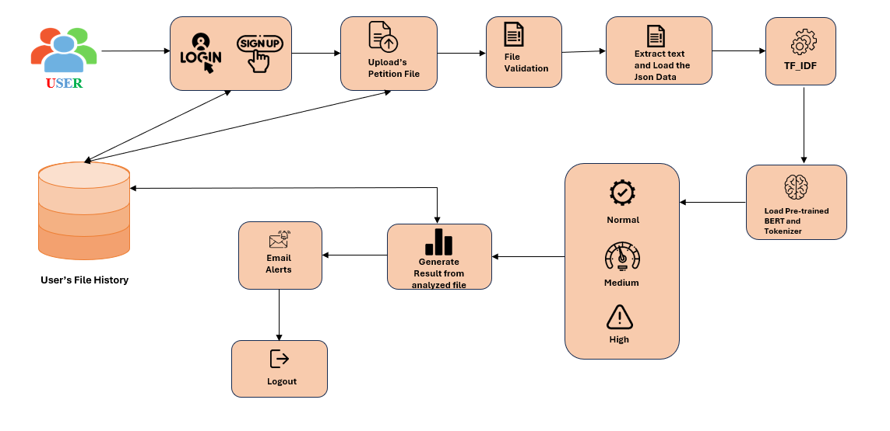

**PROBLEM STATEMENT**

Managing a large volume of petitions is challenging due to unstructured data, redundant submissions, and inefficient tracking systems. Many petitions are submitted in different formats and languages, making classification and analysis is difficult. 
Additionally, there is no proper mechanism to identify urgent cases, leading to delays in addressing critical issues. Petitioners often lack real-time status updates, resulting in frustration and a lack of transparency. 
To address these challenges, Petition Hub leverages AI-based techniques to automate petition classification, prioritize urgent cases, and automated notification ensuring efficiency and accessibility.

**ABSTRACT**

Petition Hub is an AI-powered web platform designed to streamline the process of analyzing, submitting, and manage the history of petition.
It classifies petitions, identifies urgent cases, and supports both English and Tamil petitions. 
Additionally, it provides legal suggestions to users and descriptions of relevant IPC sections. When users click the alert button, it notifies them and the corresponding department.
It integrates machine learning techniques such as BERT for classification, TF-IDF for keyword extraction, and NLTK for language processing. 
By leveraging AI, Petition Hub improves efficiency, scalability, and responsiveness in petition handling.

**INTRODUCTION**

Petition Hub is a web-based platform and easy user interfaces.
It classifies petition identifies ,urgent cases and then supporting for both English and Tamil petition.
And also provides the legal suggests to the user, it notify user through email while click on alert button.
It enhances petition management using AI-based approaches, integrating Flask with machine learning algorithms such as Bidirectional Encoder Representations from Transformers (BERT) for classification, Term Frequency-Inverse Document Frequency (TF-IDF) for keyword extraction, and the Natural Language Toolkit (NLTK) for language processing.
Langdetect used for detect the language of the petition text.

**SYSTEM ARCHITECTURE**

